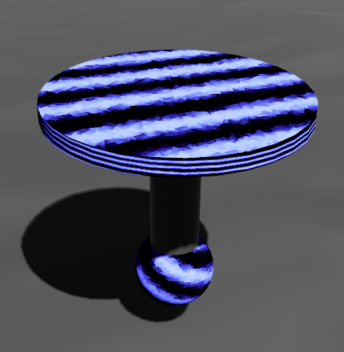

## Will a gyroscope implemented using Avian3D be able to keep an object in a vertical position?  
Everyone knows that a spinning flywheel has a gyroscopic effect, meaning it tends to maintain its position in space.
Okay, so that works in real life. I'd be interested to see if we can achieve the same effect using Avian3D?

Let's create our hero  
  
  
### Top down   
The disk, also known as a flywheel :), will spin([AngularVelocity](https://docs.rs/avian3d/latest/avian3d/dynamics/rigid_body/struct.AngularVelocity.html)) and create a gyroscopic effect.   
The body is attached to it using a [RevoluteJoint](https://docs.rs/avian3d/latest/avian3d/dynamics/joints/struct.RevoluteJoint.html).  
A sphere, which serves as our hero's wheel, is attached to the body using a [SphericalJoint](https://docs.rs/avian3d/latest/avian3d/dynamics/joints/struct.SphericalJoint.html).  
The hero will be set in motion by a [ConstantForce](https://docs.rs/avian3d/latest/avian3d/dynamics/rigid_body/forces/struct.ConstantForce.html) applied to his body in the -Z direction.  
And let him move on an uneven surface and try not to fall. 
## Video
In the video we see that while the flywheel is spinning, the vertical position is maintained, but as soon as it is stopped, the hero falls as if killed.  
.
